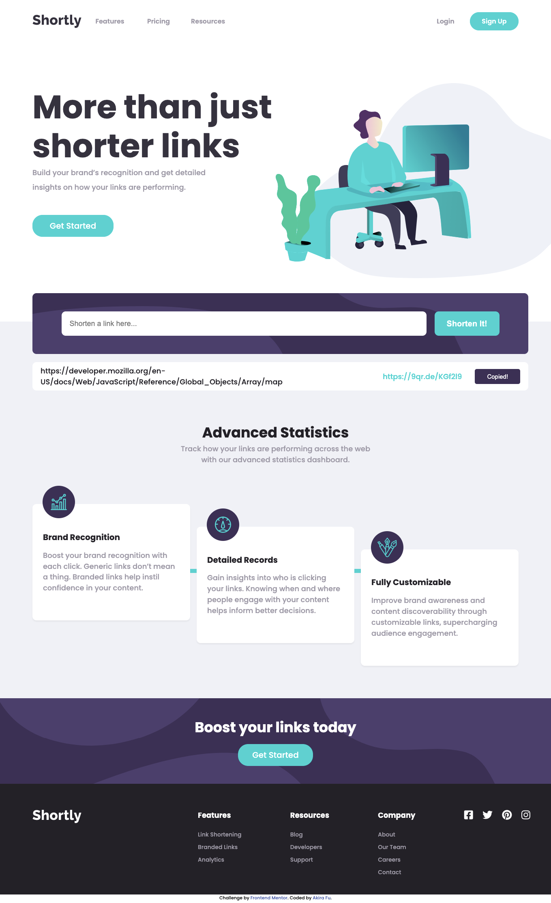
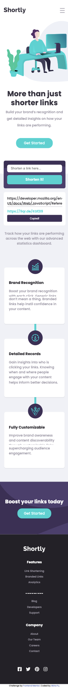

# Frontend Mentor - Shortly URL shortening API Challenge solution

This is a solution to the [Shortly URL shortening API Challenge challenge on Frontend Mentor](https://www.frontendmentor.io/challenges/url-shortening-api-landing-page-2ce3ob-G). Frontend Mentor challenges help you improve your coding skills by building realistic projects.

## Table of contents

-   [Overview](#overview)
    -   [The challenge](#the-challenge)
    -   [Screenshot](#screenshot)
    -   [Links](#links)
-   [My process](#my-process)
    -   [Built with](#built-with)
    -   [What I learned](#what-i-learned)
    -   [Continued development](#continued-development)
    -   [Useful resources](#useful-resources)
-   [Author](#author)

## Overview

### The challenge

Users should be able to:

-   View the optimal layout for the site depending on their device's screen size
-   Shorten any valid URL
-   See a list of their shortened links, even after refreshing the browser
-   Copy the shortened link to their clipboard in a single click
-   Receive an error message when the `form` is submitted if:
    -   The `input` field is empty

### Screenshot





### Links

-   Solution URL: [https://github.com/akiraafu/url-shortening-api]
-   Live Site URL: [Add live site URL here](https://your-live-site-url.com)

## My process

### Built with

-   Semantic HTML5 markup
-   CSS custom properties
-   Flexbox
-   Mobile-first workflow
-   JavaScript
-   Fetch
-   API

### What I learned

Use this section to recap over some of your major learnings while working through this project. Writing these out and providing code samples of areas you want to highlight is a great way to reinforce your own knowledge.

To see how you can add code snippets, see below:

```html
<h1>Some HTML code I'm proud of</h1>
<form id="myform" method="get">
    <input
        id="userInput"
        type="text"
        placeholder="Shorten a link here..."
        required
        oninvalid="setCustomValidity('Please add a link')"
    />

    <button type="submit" class="ctaBtn formBtn">Shorten It!</button>
</form>
```

```css
.proud-of-this-css {
   All
}
```

```js
const proudOfThisFunc = () => {
    formBtn.addEventListener("click", (e) => {
        const originLink = input.value;
        let API_URL = `https://api.shrtco.de/v2/shorten?url=${originLink}`;

        if (myform.checkValidity() === true) {
            shortenLinks.classList.add("active");
            feature.style.paddingTop = "100px";
            userLink.innerHTML = input.value;
            e.preventDefault();
            shorterLink();
        }

        async function shorterLink() {
            const request = new Request(API_URL);
            const response = await fetch(request);
            const links = await response.json();

            let result = links["result"]["full_short_link2"];

            outputLink.innerHTML = result;

            outputLink.innerHTML;

            // copy button function

            copyBtn.addEventListener("click", () => {
                navigator.clipboard.writeText(result);
                copyBtn.style.backgroundColor = "var(--Dark-Violet)";
                copyBtn.innerHTML = "Copied!";
            });
        }

        input.value = "";
        let copyBtn = document.querySelector(".copyBtn");

        copyBtn.style.backgroundColor = "var(--Cyan)";
        copyBtn.innerHTML = "Copy";
    });
};
```

### Continued development

Create more media queries for more devices

### Useful resources

-   [MDN](https://developer.mozilla.org/en-US/)
-   [Stackoverflow](https://stackoverflow.com/)

## Author

-   Website - [akiraafu](https://github.com/akiraafu)
-   Frontend Mentor - [@akiraafu](https://www.frontendmentor.io/profile/akiraafu)
